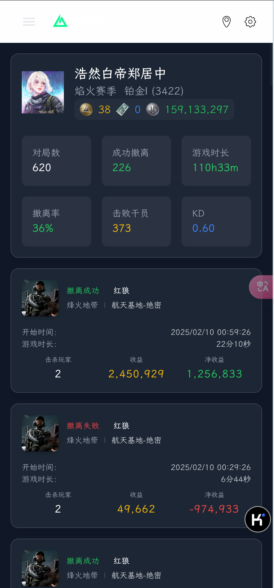
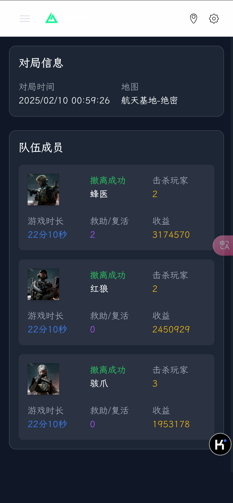

# df-web

## 简介

### 前端

仓库：[https://github.com/zhuba-Ahhh/df-web](https://github.com/zhuba-Ahhh/df-web)
地址：[https://df-web-delta.vercel.app](https://df-web-delta.vercel.app/)

- React + Vite
- Tailwind + Daisyui 样式
- Vercel 部署

### 后端

仓库：[https://github.com/zhuba-Ahhh/df-api](https://github.com/zhuba-Ahhh/df-api)
地址：[https://df-api.vercel.app](https://df-api.vercel.app)

- nestJs
- Vercel 部署

### 预览

